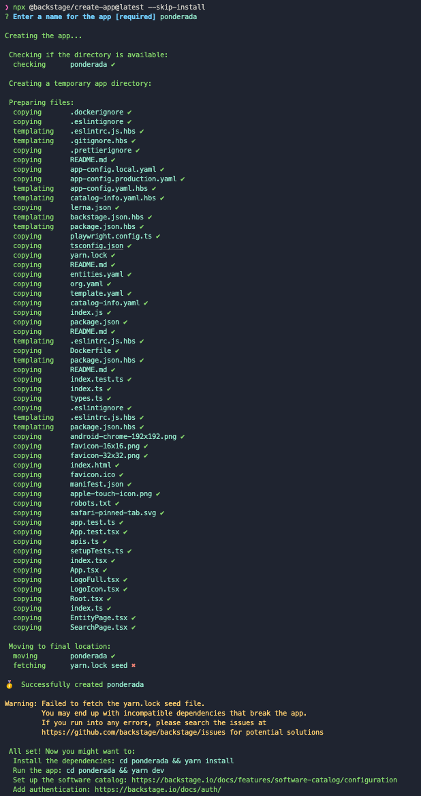
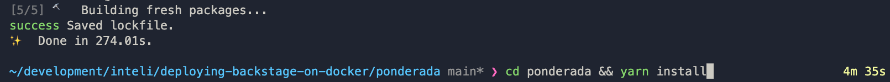
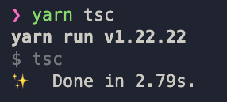
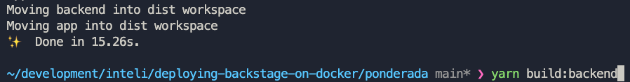
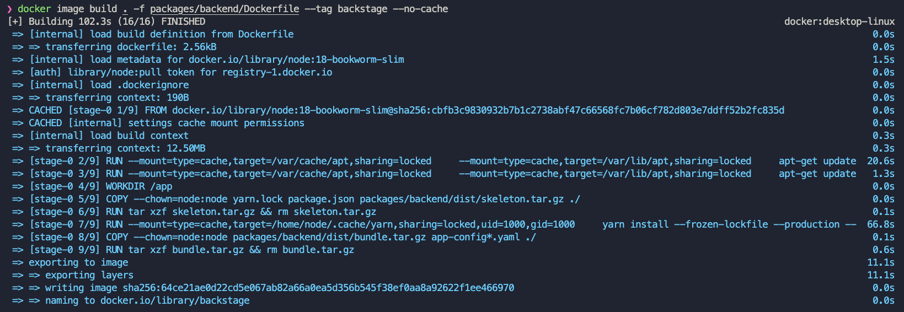
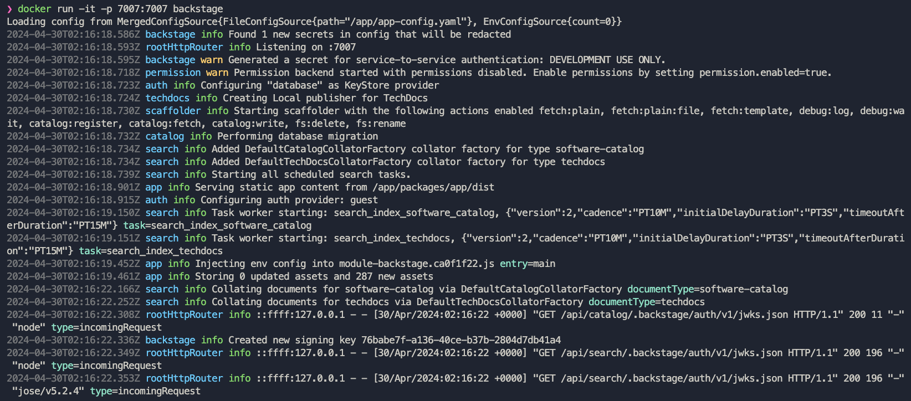
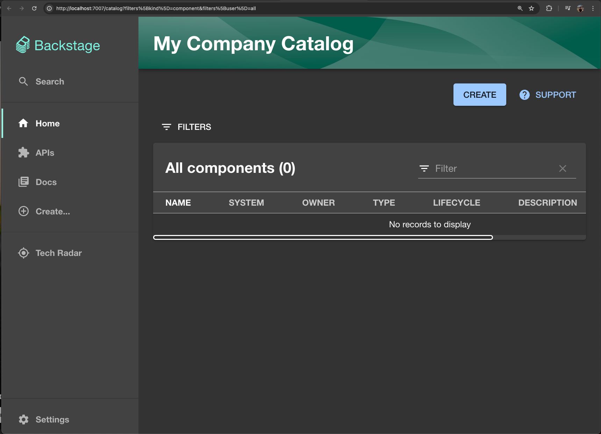

# Deploying Backstage on Docker

## Instalação do Backstage

Criar seu projeto Backstage.

1. Crie o projeto:
   ```shell
   npx @backstage/create-app@latest --skip-install
   ```
   

2. Instale as dependências:
   ```shell
   yarn install
   ```
   

## Preparação do Projeto para Build

Execute os seguintes comandos para preparar seu projeto para a compilação.

1. Instale as dependências:
   ```shell
   yarn install --frozen-lockfile
   ```

2. Gere os arquivos de definição de tipos:
   ```shell
   yarn tsc
   ```
   

3. Compile o backend da aplicação:
   ```shell
   yarn build:backend
   ```
   

## Ajustando o Dockerfile

Modifique o `Dockerfile` localizado em `packages/backend/Dockerfile` com as configurações apropriadas.

```dockerfile
FROM node:18-bookworm-slim

# Install isolate-vm dependencies, these are needed by the @backstage/plugin-scaffolder-backend.
RUN --mount=type=cache,target=/var/cache/apt,sharing=locked \
    --mount=type=cache,target=/var/lib/apt,sharing=locked \
    apt-get update && \
    apt-get install -y --no-install-recommends python3 g++ build-essential && \
    yarn config set python /usr/bin/python3

# Install sqlite3 dependencies. You can skip this if you don't use sqlite3 in the image,
# in which case you should also move better-sqlite3 to "devDependencies" in package.json.
RUN --mount=type=cache,target=/var/cache/apt,sharing=locked \
    --mount=type=cache,target=/var/lib/apt,sharing=locked \
    apt-get update && \
    apt-get install -y --no-install-recommends libsqlite3-dev

# From here on we use the least-privileged `node` user to run the backend.
USER node

# This should create the app dir as `node`.
# If it is instead created as `root` then the `tar` command below will
# fail: `can't create directory 'packages/': Permission denied`.
# If this occurs, then ensure BuildKit is enabled (`DOCKER_BUILDKIT=1`)
# so the app dir is correctly created as `node`.
WORKDIR /app

# This switches many Node.js dependencies to production mode.
ENV NODE_ENV development

# Copy repo skeleton first, to avoid unnecessary docker cache invalidation.
# The skeleton contains the package.json of each package in the monorepo,
# and along with yarn.lock and the root package.json, that's enough to run yarn install.
COPY --chown=node:node yarn.lock package.json packages/backend/dist/skeleton.tar.gz ./
RUN tar xzf skeleton.tar.gz && rm skeleton.tar.gz

RUN --mount=type=cache,target=/home/node/.cache/yarn,sharing=locked,uid=1000,gid=1000 \
    yarn install --frozen-lockfile --production --network-timeout 300000

# Then copy the rest of the backend bundle, along with any other files we might want.
COPY --chown=node:node packages/backend/dist/bundle.tar.gz app-config*.yaml ./
RUN tar xzf bundle.tar.gz && rm bundle.tar.gz

CMD ["node", "packages/backend", "--config", "app-config.yaml"]
```

## Criar a Imagem do Backstage e Rodar o Docker

1. Crie a imagem Docker do Backstage executando:
   ```shell
   docker image build . -f packages/backend/Dockerfile --tag backstage --no-cache
   ```
   

2. Inicie o container do Backstage:
   ```shell
   docker run -it -p 7007:7007 backstage
   ```
   

Acesse `http://localhost:7007` em seu navegador para começar a usar o Backstage.

## Catálogo de Serviços Backstage

Aqui está como o Catálogo de Serviços deve parecer após a execução bem-sucedida.

   
